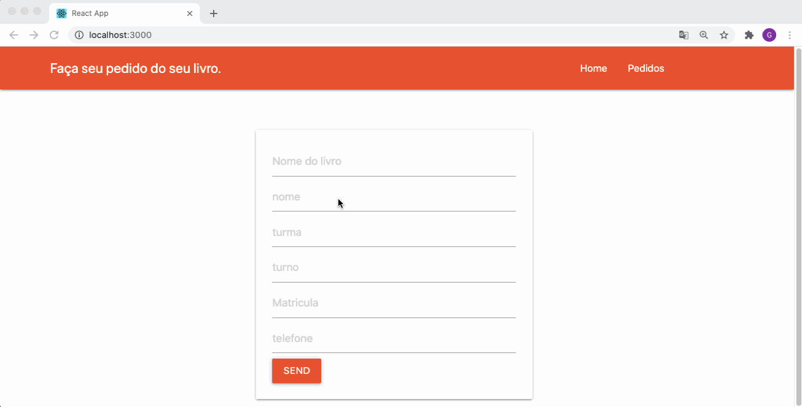

<html>
   <body>
  <h1 align="center">Cadastro de Livro</h1>
<h4 align="center">
   
</h4>

  <a href="#tecnologias">Tecnologias</a>&nbsp;&nbsp;&nbsp;|&nbsp;&nbsp;&nbsp;
  <a href="#page_facing_up-sobre">Sobre</a>&nbsp;&nbsp;&nbsp;|&nbsp;&nbsp;&nbsp;
  <a href="#-como-usar">Como usar</a>&nbsp;&nbsp;&nbsp;|&nbsp;&nbsp;&nbsp;
  <a href="#pencil-autor">Autor</a>

## :wrench: Tecnologias

<!--EXEMPLO:-->
- [React](https://pt-br.reactjs.org/)
- [Axios](https://www.npmjs.com/package/axios)
- [React Router](https://www.npmjs.com/package/react-router-dom)
- [Materialize Css](https://materializecss.com/)

## :page_facing_up: Sobre

Projeto que desenvolvi baseado em biblotecas. Onde é possível cadastrar livros, listar todos os livros cadastrados, editar algum livro em especifico ou até deletar livros da base de dados. Um caso de uso interessante seria para alunos utilizarem esse projeto para, com facilidade, descobrirem quais livros estão disponíveis para alugar. Caso queira saber mais sobre o projeto, clique no botão abaixo.               
## 💻 Como usar

- Clone o projeto: `git clone https://github.com/Gabriel200395/cadastro-livro.git`
- Entrar na pasta do projeto: `cd cadastro-livro`
- Iniciar a aplicação: `npm start`
- baixe na aplicação: `npm install`

Irá abrir uma página no browser (se não abrir, vá até [http://localhost:8080](http://localhost:8080/)).
## :pencil: Autor

<table>
  <tr>
    <td align="center"><a href="https://github.com/Gabriel200395"> <b>Gabriel Souza</b></a> </td>
  <tr>
</table>

